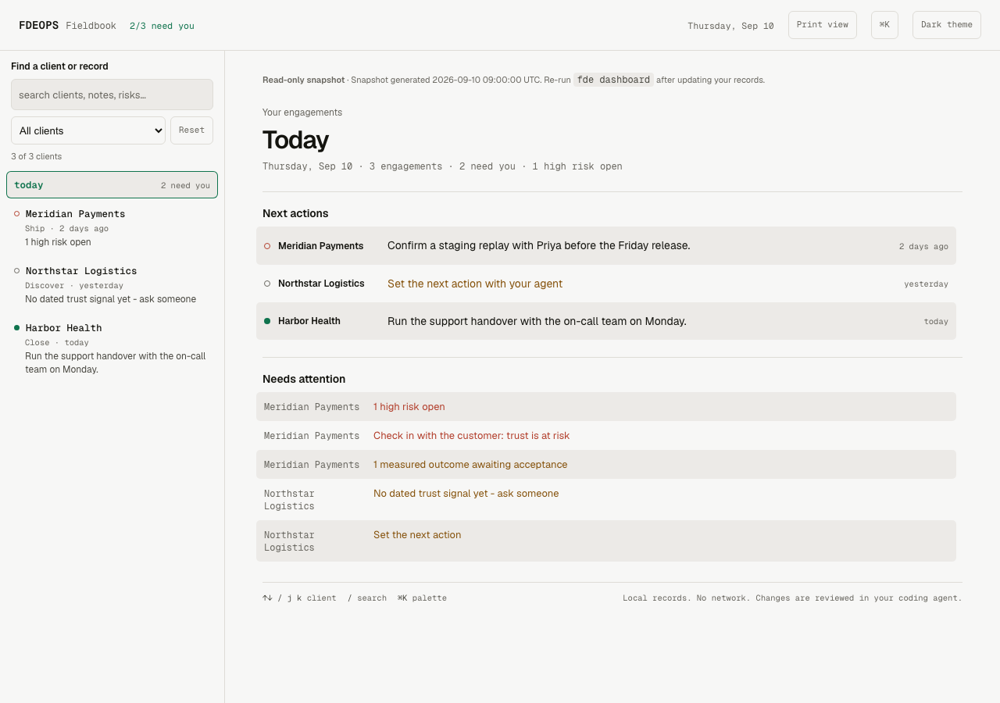

# FDEOps

**One client record, from first meeting to handover.**

FDEOps helps a Forward Deployed Engineer or independent expert manage client work with an AI coding agent. Keep the brief, decisions, delivery evidence, acceptance, and next actions together across repositories and sessions.

One `@fde` skill guides the work. A local CLI records it in Markdown. A read-only dashboard shows one client or your portfolio. You review judgments and obtain customer approval; the tool does not decide for them.


---

## Quick Start

**Inspect a repository first.** Requires Node.js 18+ and Git. Run from a local repository:

```bash
npx fdeops scan
```

`npx` may download the package. The scan itself reads local files, prints reconnaissance and questions, and does not write engagement records.

**Then install the skill:**

```bash
npx skills add suboss87/fdeops --skill fde
```

One chat. Name the client:

```text
@fde this is client01
```

The agent creates and binds `~/fde-engagements/client01/.fde/` to the workspace. Paste kickoff notes; review the proposed decisions, risks, and next actions before saving. If setup cannot run in your host, use `npx fdeops resume --init client01` to create the engagement and binding.

Open the engagement fieldbook anytime:

```bash
npx fdeops dashboard --open
```

Read-only HTML of the record - promised, measured, accepted, and evidence. Regenerate after you change memory. Day to day: [docs/USAGE.md](docs/USAGE.md).

<details>
<summary><b>Claude Code</b></summary>

```text
/plugin marketplace add suboss87/fdeops
/plugin install fdeops@fdeops
```

The plugin registers Claude Code session hooks and slash commands. A skill-only install does not register hooks.

</details>

<details>
<summary><b>Cursor</b></summary>

After the skill install, in the **client repo** you have open (pointer, not a second pack):

```bash
npx fdeops adapters .
```

See [adapters/](adapters/README.md).

</details>

<details>
<summary><b>Clone install and offline use</b></summary>

```bash
git clone https://github.com/suboss87/fdeops.git
cd fdeops
node bin/install.js
```

If the agent cannot create the folder:

```bash
npx fdeops resume --init client01   # ~/fde-engagements/client01
```

For offline use, transfer the checkout first; cloning and package downloads need network access. Override: `FDEOPS_ENGAGEMENT`. See [docs/install.md](docs/install.md).

</details>

---

## Commands

One command per stage. Skills load automatically.

Six stages organize the engagement: Land, Discover, Plan, Ship, Outcome, Close. Start with the current situation; revisit earlier decisions when the evidence changes. Slash commands below are provided by the Claude Code plugin. In other hosts, describe the same request to `@fde`.

| What you're doing | Command | Stage |
|-------------------|---------|-------|
| First days. Get the brief. Name who signs. | `/brief` | Land |
| Check the brief is the real job. | `/discover` | Discover |
| Sequence from done, not from the ticket. | `/plan` | Plan |
| Prove it on their staging, then go live. | `/ship` | Ship |
| What you promised, measured, and who accepted. | `/outcome` | Outcome |
| Hand it over. They run it without you. | `/close` | Close |

Same `@fde`, when you need them: `/debrief` (notes into the record), `/prep` (one page before you walk in), `/trust` (process gap, or they stopped trusting you), `/receipts` (a dated line, or it did not happen), `/readout` (Friday page for the sponsor; not a seventh stage).

You can also describe the situation in plain English: a new client, a POC, an incident, a scope change, or a question about what was agreed.

---

## Your daily fieldbook



*Fictional client records, shown in the built-in dark theme. The report works offline.*

Read [verification results and limits](docs/verification.md) for context measurements, local-model observations, and MCP coverage.

Open `npx fdeops dashboard --all --open` to review every client. Filter what needs attention, open a client, and copy **Continue next action** into your agent. After a meeting, use **Debrief notes**; before a sponsor update, use **Review outcome**. These buttons copy prompts; work runs in your agent. Review changes there and regenerate the dashboard afterward.

## Try the complete loop

```bash
npx fdeops demo
```

This writes fictional records and HTML under `~/fde-engagements/.demo/`, resetting its own sandbox on each run. It requires no AI account. Open the generated report; remove the demo later with `npx fdeops demo --clean`. Follow the [five-minute walkthrough](docs/USAGE.md#new-here-5-minutes) for what to inspect.


---

## All 30 Skills

Not prompts to choose from: the router loads one relevant skill with concrete steps, an artifact, and a checkpoint. The [skills reference](docs/skills-reference.md) lists all 30, from discovery and scope control to incident response and handover. Industry and AI overlays apply when relevant.

Optional external sources use your configured MCP connections. The agent pulls on request, stages the material, and asks you to review its interpretation before applying it. The CLI itself stays local. See [source recipes](mcp/recipes/) and [ingest usage](docs/USAGE.md#ingest-pull-large-artifacts--same-confirm-loop).

---

## How Skills Work

One `@fde`. One file per situation. One folder per client.

```
  "@fde this is client01"      creates ~/fde-engagements/client01/.fde/
  /brief  or  English          the AI coding agent loads skills/fde/SKILL.md
           │  routes. you never pick a skill by name
           ▼
  references/<one>.md          one skill, then stop
           │
           ▼
  fde CLI (local)              dates, gates, redacts. no network
           │  after you confirm
           ▼
  ~/fde-engagements/client01/.fde/
           │
           ▼
  fde dashboard --open         offline fieldbook (read-only snapshot)
```

**A dated line, or it did not happen.** Promised → measured → accepted, with evidence for the measurement. If it is not in `.fde/`, it is not on the record.

**Review judgments before recording them.** The agent shows proposed interpretations for confirmation. Direct CLI writes execute when invoked; enabled session hooks also capture mechanical session state automatically. Recording a note does not establish customer approval.

**The record is on your laptop.** Change hosts and keep the same Markdown. Claude Code plugins provide automatic session hooks; other hosts use `@fde` and CLI commands on demand. See the [install matrix](docs/install.md#who-needs-which-install).

One skill hosts load: `skills/fde/SKILL.md`. It opens one file in `skills/fde/references/` and stops. Slash commands live in `.claude/commands/`. The local CLI is `bin/fde.js` (git + files, no network). Layout: [docs/REPO_LAYOUT.md](docs/REPO_LAYOUT.md).

---

## Engagement memory (`.fde/`)

One folder per client. Plain markdown. Grep it, copy it, take it into a meeting.

| File | Holds |
|------|-------|
| `context.md` | Where you are |
| `brief.md` / `success.md` | What they asked; what “done” is and who signs |
| `reality.md` / `terrain.md` | The real problem; the map |
| `stakeholders.md` | `[signal:green\|amber\|red]` - worst active signal wins; empty is **new**, not green |
| `trust-profile.md` | Sacred data, AI policy, approval chain |
| `decisions.md` / `risks.md` / `delivery.md` | Dated choices; live risks; what shipped, evidence, rollback, acceptance |

Schema: [docs/schema.md](docs/schema.md). Fieldbook: `npx fdeops dashboard --open` (bound) or `--all --open` (portfolio).

---

## Who this is for

Forward Deployed Engineers, independent consultants, and solo agencies delivering inside customer systems. Use a separate engagement folder for each client and a workspace binding to select the right record.

If you ship your own company's product from HQ, with no customer team that has to run it after you leave, you do not need this kit.

---

## Your data stays yours

The **CLI** is local: git + files, no network, no telemetry. The **host model** sees `.fde/` the agent loads (usually a bounded `context.md`) and any client code you open. It must not see `<private>` blocks - redacted from CLI, dashboard, and hooks; do not paste them or open them with file tools. Keep the engagement folder outside cloud-sync locations unless customer policy permits that storage. Generated reports can still contain confidential information after redaction; review them before sharing.

[PRIVACY.md](PRIVACY.md) · [SECURITY.md](SECURITY.md)

---

## Principles

- **Who signs** - name them in the first days
- **Brief vs real job** - check the floor, not only the slide
- **Back from done** - sequence from signed-off, not from the ticket
- **Their staging then live** - prove it where they operate, then go live
- **Promised, measured, accepted** - a number nobody signed is claimed, not delivered; keep the evidence
- **They run it** - if they cannot operate it without you, you are not done
- **A dated line, or it did not happen** - these files get defended in the room
- **One customer, one folder** - verify the active binding before writing
- **The kit says what to check. You still decide.**

---

## Project Structure

| Folder | Responsibility |
|---|---|
| `skills/fde/` | One router and the delivery methodology |
| `bin/` | Local CLI, installer, and shared helpers |
| `templates/.fde/` | Client record templates |
| `adapters/` and `hooks/` | Host entry points and session integration |
| `mcp/` | Optional ingest wrapper and source recipes |
| `test/` and `evals/` | Code regressions and workflow evaluations |
| `docs/` and `examples/` | Usage, contributor guides, and fictional engagements |

See [repository layout](docs/REPO_LAYOUT.md) for where to make changes.


---

## Contributing

**[Subash Natarajan](https://www.linkedin.com/in/subashn/)**. [Issues](https://github.com/suboss87/fdeops/issues) · [Discussions](https://github.com/suboss87/fdeops/discussions) · [CONTRIBUTING.md](CONTRIBUTING.md) · [Code of Conduct](CODE_OF_CONDUCT.md)

Skills should be **specific** (actionable steps), **verifiable** (an artifact in `.fde/`), and **minimal**. The `fde` CLI stays local-only.

## License

MIT - use these skills on client work.
