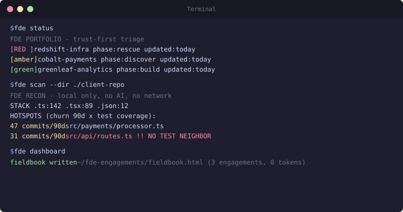

# fdeops

**Your AI coding agent forgets your client every morning. fdeops remembers.**

[](https://www.npmjs.com/package/fdeops)
[](https://github.com/suboss87/fdeops/actions)
[](LICENSE)
[](https://nodejs.org)

Built for **Forward Deployed Engineers** - engineers embedded at a client, from first meeting to final handoff. Works the same for consultants, agency developers, solutions architects, and fractional CTOs.

---

## The problem

Your AI coding agent's memory is scoped to a **repo**. Client work isn't: one engagement spans several repos, a dozen stakeholders, and decisions made in meetings your agent never saw. That context lives in rooms, chats, and hallway conversations - nothing writes it down where your tools can use it.

fdeops adds the missing layer: memory scoped to the **client** - plain markdown at `~/fde-engagements/<client>/.fde/`, written as a side effect of doing the work. Local only, zero dependencies, no network, no telemetry.

## Without fdeops vs with fdeops

| Moment | Without fdeops | With fdeops |
|---|---|---|
| **Monday morning** | Re-paste last week's context, re-explain the stakeholders | A hook loads the engagement at session start - the agent opens knowing the deadline and the open thread |
| **After a meeting** | Notes rot in a scratch file | `fde debrief` routes decisions, risks, deliveries, and contacts into the record, dated |
| **Scope dispute** | "Small" additions absorbed silently; no record when the sponsor asks | `fde receipts <term>` answers "when did we agree to that?" with dates |
| **Quiet stakeholder** | Noticed three weeks too late | `fde log contact --signal amber` the day it happens; `fde status` surfaces it |
| **Multiple clients** | Details blur across engagements | One folder per client, never cross-contaminated |

---

## Quickstart

**1. Install** (Claude Code)

```text
/plugin marketplace add suboss87/fdeops
/plugin install fdeops@fdeops
```

**2. Bind your client workspace** - run once, inside the workspace:

```bash
fde resume --init garvey
```

fdeops' `--init` creates the engagement memory at `~/fde-engagements/garvey/.fde/` (plain markdown, private to your machine) and binds this workspace to it. The hooks read that binding - context auto-loads at session start, auto-captures at session end. That is the whole setup.

**3. Work**

```text
@fde I just got the brief. New client, payments platform, they want it live before their Q3 audit.
```

`@fde` is the one skill fdeops installs. Describe what's happening; it routes to the right field method and the memory writes itself. Full workflow: [docs/USAGE.md](docs/USAGE.md).

Not ready to install? `npx fdeops scan` runs on any repo you can read - day-1 recon (pure `git` + file reads, no config, no account) that maps hotspots, test gaps, and reverted attempts, and ends with the ASK ON DAY 1 questions the brief never mentions.

<details>
<summary><strong>Other install paths</strong> - Cursor, Codex, Copilot, Gemini CLI, local LLMs, air-gapped</summary>

- **Cursor / Codex / Copilot / Gemini CLI:** `npx fdeops adapters .` drops a thin pointer to the same `@fde` skill - [adapters/](adapters/README.md)
- **Local LLMs (Ollama, LM Studio, llama.cpp):** load `skills/fde/SKILL.md` as the system prompt - [guide](adapters/LOCAL-LLM.md)
- **Skills CLI:** `npx skills add suboss87/fdeops`
- **Manual / air-gapped:** `git clone https://github.com/suboss87/fdeops.git && cd fdeops && node bin/install.js`
- **Requires:** [Node.js](https://nodejs.org) >= 18 for the CLI and adapters; the Claude Code plugin install does not need Node separately.
- **Advanced:** the `FDEOPS_ENGAGEMENT` env var overrides the workspace registry - only for unusual setups. Full matrix: [docs/install.md](docs/install.md)

</details>

---

## How it works

Two hooks and one router, on top of the fieldbook:

- **Session start** - a hook loads where you left off into your AI coding agent's context
- **Session end** - a hook captures what happened back into the fieldbook
- **After meetings** - `fde debrief notes.md` routes lines prefixed `decision:` / `risk:` / `delivery:` / `contact:` to the matching file, dated; everything else lands as a dated block in `context.md`
- **On top of the memory** - the `@fde` skill routes six phase verbs:

| Verb | When |
|------|------|
| **land** | First days at a new client - interrogate the brief, map stakeholders, define success |
| **discover** | The brief feels wrong - find the real problem, with evidence from the repo |
| **plan** | Scope agreed - sequence it backwards from success, in PR-sized slices |
| **build** | Ready to write code - declare blast radius, log deliveries as you ship |
| **ship** | Going to production - pre-flight, canary, tested rollback |
| **close** | Engagement ending - handoff doc, retrospective, receipts that survive you |

Overlays for regulated domains (AI, fintech, healthcare, government) activate on signal. fdeops complements your agent's native repo memory: CLAUDE.md holds how the *code* works; the fieldbook holds how the *engagement* works. Full matrix: [docs/skills.md](docs/skills.md).

Works with **Claude Code** - **Cursor** - **Copilot** - **Devin** - **Gemini CLI** - **Ollama** - **LM Studio** - any model that reads a markdown file.

---

## Engagement memory (`.fde/`)

The **fieldbook** - one folder per client, plain markdown you can read, grep, and take with you:

| File | Holds |
|------|-------|
| `context.md` | Where you are - loaded first every session |
| `brief.md` / `success.md` | What they asked for; what "done" means and who signs it off |
| `reality.md` / `terrain.md` | The real problem; the codebase map |
| `stakeholders.md` | Champions, resistance, `[signal:green\|amber\|red]` trust tokens |
| `trust-profile.md` | Sacred data, AI policy, approval chain |
| `decisions.md` / `risks.md` / `delivery.md` | Choices with dates; live risk register; what shipped and its rollback |

Every entry is dated and sourced, so you can defend it in front of skeptical stakeholders. Schema: [docs/schema.md](docs/schema.md).

---

## The CLI

Deterministic, offline, zero tokens - the skill adds judgment on top:

```bash
fde scan                          # day-1 recon + ASK ON DAY 1 questions (works via npx)
fde resume                        # load this workspace's engagement
fde resume --init <client>        # THE setup step: create + bind an engagement
fde debrief notes.md              # route meeting notes into memory (also reads stdin)
fde log decision "descope agreed with Kowalczyk"
fde log contact "Denise gone quiet" --signal amber
fde receipts <term>               # dated search; no hit = a gap in the record, not proof of absence
fde status                        # portfolio triage across all clients (red > amber > green)
fde dashboard                     # render every engagement into one offline HTML fieldbook
```

The latest dated `[signal:...]` token per stakeholder drives the trust column in `status` and `dashboard`; signals older than 21 days show as stale.

<p align="center"></p>

`fde dashboard` renders every engagement into one offline HTML fieldbook - engagements sorted by trust, next action and open risks per client, one glance to know where to start:

<p align="center"></p>

---

## Who this is for

| You are... | What fdeops does for you |
|----------|-------------------|
| **Forward Deployed Engineer** | The role this was built for - the full lifecycle, first meeting to final handoff |
| **Consultant or contractor at a client site** | Remembers the engagement so you stop re-explaining it |
| **Solutions architect / engineer** | Methods for the politics as well as the architecture |
| **Agency developer running 3-5 clients** | One `.fde/` per client - details stop blurring |
| **Fractional CTO doing client work** | The fieldbook is your second brain - and your audit trail for billable work |

---

## Your data stays yours

- **Local only.** Pure `git` + file reads - no network calls, no telemetry, no account. Works air-gapped.
- **Plain markdown.** No database, no lock-in.
- **No new data path.** The AI sees client code only when *you* point your agent at it; `<private>`-tagged data never enters the model's context.
- **Nothing enters the record unreviewed.** The model drafts, you confirm (`fde debrief --dry-run` shows the routing first); the hooks record only git facts. Your fieldbook stays yours to defend.
- **Know your sync surface.** `~/fde-engagements` lives in your home directory - your backup and cloud-sync setup now covers client notes. `fde resume --init` warns if the folder sits in a synced path. Read [PRIVACY.md](PRIVACY.md) before your first NDA'd engagement.

Details: [PRIVACY.md](PRIVACY.md) · [SECURITY.md](SECURITY.md)

---

## Principles

- **The artifact is the memory** - producing work and recording it are one action
- **Trust before production** - earn the right to touch their systems
- **Brief is a hypothesis** - discover before building the wrong thing
- **Evidence on every claim** - these files get defended in front of skeptical clients
- **Thin slices** - ship learning, not theatre
- **One customer, one folder** - context never bleeds

---

## Updating

```bash
cd fdeops && git pull && node bin/install.js
```

---

## Contributing

Built and maintained by **[Subash Natarajan](https://www.linkedin.com/in/subashn/)**. Share your feedback via [Issues](https://github.com/suboss87/fdeops/issues) - see [CONTRIBUTING.md](CONTRIBUTING.md).

[FDE Methodology](FDE-METHODOLOGY.md) - [ATTRIBUTION.md](ATTRIBUTION.md) - [SECURITY.md](SECURITY.md) - [PRIVACY.md](PRIVACY.md) - [Repo layout](docs/REPO_LAYOUT.md) - [Skills matrix](docs/skills.md) - MIT
