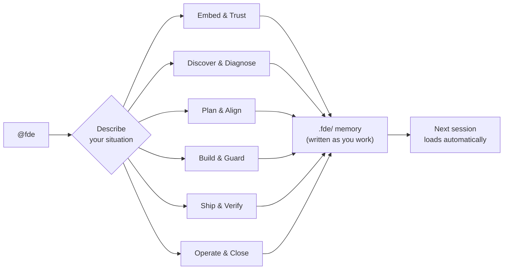

# FDEOps

**The discipline and methodology for Forward Deployed Engineers.**

[](https://www.npmjs.com/package/fdeops)
[](https://github.com/suboss87/fdeops/actions)
[](LICENSE)
[](https://nodejs.org)

You embed at a client site. You bridge strategy and code. You ship on their systems, not yours.

Every morning you open your AI coding agent, and it has no idea what happened yesterday. You re-paste the same context. You explain the stakeholders again. You remind it about the scope change from Tuesday. Meanwhile, the real problem - the one the brief didn't mention - sits undiscovered because nobody asked the right questions on day one.

**fdeops fixes this.** One `@fde` command gives your AI coding agent a complete engagement methodology and a memory that writes itself. Describe your situation and the right method runs - from first stakeholder meeting to final handoff. Tomorrow's session starts exactly where today ended.

---

## Quickstart

### 1. Install

**Claude Code**
```
/plugin marketplace add suboss87/fdeops
/plugin install fdeops@fdeops
```

**Cursor · Codex · Copilot · Gemini CLI**
```bash
npx fdeops adapters .
```

**Local LLMs** - load `skills/fde/SKILL.md` as system prompt ([guide](adapters/LOCAL-LLM.md))

### 2. Create your first engagement

```bash
npx fdeops init my-client                                    # creates engagement memory
export FDEOPS_ENGAGEMENT=~/fde-engagements/my-client/.fde    # point your tool at it
```

Creates 12 markdown files at `~/fde-engagements/my-client/.fde/` - private to your machine, never uploaded.

### 3. Start working

```
@fde I just got the brief. New client, payments platform, 3-week timeline.
```

Describe what's happening and the agent picks the right method. No configuration files to edit. No API keys. See [docs/USAGE.md](docs/USAGE.md) for the full workflow.

> **Requires:** [Node.js](https://nodejs.org) >= 18 (for CLI and adapters). Claude Code plugin install does not require Node separately.
>
> **Other install methods:** `npx skills add suboss87/fdeops` (Skills CLI) or `git clone https://github.com/suboss87/fdeops.git && cd fdeops && node bin/install.js` (manual). Full install details: [docs/install.md](docs/install.md).

---

## Who this is for

| You are... | What fdeops does for you |
|----------|-------------------|
| **Forward Deployed Engineer** | The role this was built for. 35 skills across the full engagement lifecycle - land, build, ship, close. |
| **Consultant or contractor at a client site** | Every session, you re-explain context. fdeops remembers for you. |
| **Solutions architect bridging strategy and code** | You navigate politics AND architecture. fdeops has methods for both. |
| **Agency engineer running 3-5 clients** | Client details blur together. One `.fde/` per customer, never cross-contaminated. |
| **Technical founder doing client work solo** | You ARE the team. The agent becomes your second brain. |

---

## How it works



1. **Describe** your situation - "new client", "production is down", "need a board update", "red-team my handoff plan"
2. **Route** - the skill picks the right method from 35 options across 6 domains
3. **Execute** - the method runs, artifacts are written to `.fde/`, you review at checkpoints
4. **Compound** - next session loads the memory automatically. Context never starts from zero again.

<p align="center">

Works with **Claude Code** - **Cursor** - **Copilot** - **Devin** - **Gemini CLI** - **Ollama** - **LM Studio** - any model that reads a markdown file

---

## Without fdeops vs with fdeops

| | **Without fdeops** | **With fdeops** |
|---|-------------------|----------------|
| **Monday morning** | Re-paste last week's context, explain the stakeholders again | Agent opens with "last session you were on the ingest retry - CTO demo is Friday" |
| **Scope creep** | Five "small" additions absorbed silently, timeline slips | Receipts timestamped - you walk into the sponsor meeting with evidence |
| **Multiple customers** | Wrong client name in a status update, details blur | One folder per customer, context-switch protocol, cross-contamination checklist |
| **The sponsor meeting** | "We completed the API endpoint" | "Manual reconciliation dropped from 3 FTEs to 0.5 - here's the rollback if it turns" |

---

## 35 skills + 5 overlays

| Domain | Skills | What it covers |
|--------|--------|---------------|
| **Embed & Trust** | land, audit, stakeholder-radar, trust-engineering, scope-defense | First days: access, credibility, scope |
| **Discover & Diagnose** | discover, assumption-audit, use-case-scoring, sketch | Finding the real problem behind the brief |
| **Plan & Align** | plan, business-case, options-analysis, initiative-triage | Sequencing work, getting sponsor alignment |
| **Build & Guard** | build, incremental-build, test-on-legacy, blast-radius, debug, rescue, security-audit, observability | Building safely on their codebase |
| **Ship & Verify** | ship, review, rollback-drill, qa-live | Getting to production without surprises |
| **Operate & Close** | status, demo-prep, debrief, exec-narrative, dashboard, multi-customer-ops, close, handoff-engineering, pattern-extract, red-team | Running and ending the engagement well |

**Overlays** activate automatically when your engagement involves AI projects, executive reporting, fintech, healthcare, or government compliance.

Full skill details: [docs/skills-reference.md](docs/skills-reference.md)

---

## Engagement memory (`.fde/`)

Your **fieldbook** - one per client, private to you, plain markdown:

| File | Role | Written by |
|------|------|-----------|
| `context.md` | Where you are; loaded first every session | every phase + session-stop hook |
| `brief.md` | What they said - hypothesis until discover | land |
| `success.md` | Done, measured, signed-off by whom | land |
| `reality.md` | The real problem, with evidence | discover / audit |
| `terrain.md` | Codebase map: hotspots, test gaps, AI components, data estate | discover / audit |
| `stakeholders.md` | Champions, resistance, trust signals | land, updated continuously |
| `trust-profile.md` | Sacred data, AI policy, approval chain | land + overlays |
| `decisions.md` | Plan + choices + integration contracts + sizing | plan / build / review / rescue |
| `risks.md` | Live risk register | all phases |
| `delivery.md` | What shipped, business value, rollback, pulse, adoption metrics | build / ship |

Every claim is tagged with its source and date so you can defend it in front of skeptical stakeholders.

---

## The CLI

Your engagement toolkit - deterministic, offline, always available:

```bash
fde scan       # day-1 recon: hotspots, test gaps, secrets, AI components
fde resume     # initialize or resume an engagement
fde log        # write decisions, risks, delivery, contacts
fde receipts   # search memory with dates - "what did we agree about X?"
fde capture    # session-end snapshot
fde status     # portfolio triage across all customers (red > amber > green)
fde dashboard  # render every engagement into one offline HTML fieldbook
```

<p align="center"></p>

---

## Works with any AI coding tool

One skill file powers every tool. Each adapter is a thin pointer at the same `@fde` skill - the methodology and memory stay consistent whether you use Claude Code, Codex, Cursor, Copilot, Gemini CLI, or a local model. Details: [`adapters/`](adapters/README.md).

> **No cloud dependency.** fdeops calls no external API. The AI skill is a markdown file your model reads. The CLI is local Node.js. Works fully offline, fully air-gapped, fully private. See [`adapters/LOCAL-LLM.md`](adapters/LOCAL-LLM.md) for local model setup.

---

## Principles

- **The artifact is the memory** - producing work and recording it are one action
- **Trust before production** - earn the right to touch their systems
- **Brief is a hypothesis** - discover before building the wrong thing
- **Evidence on every claim** - these files get defended in front of skeptical clients
- **Map before moving** - unknown terrain gets characterisation tests
- **Thin slices** - ship learning, not theatre
- **One customer, one folder** - context never bleeds

---

## Updating

```bash
cd fdeops && git pull && node bin/install.js
```

---

## Contributing

Built and maintained by **[Subash Natarajan](https://www.linkedin.com/in/subashn/)**. Share your feedbacks via [Issues](https://github.com/suboss87/fdeops/issues) - see [CONTRIBUTING.md](CONTRIBUTING.md).

[FDE Methodology](FDE-METHODOLOGY.md) - [ATTRIBUTION.md](ATTRIBUTION.md) - [SECURITY.md](SECURITY.md) - [PRIVACY.md](PRIVACY.md) - [Repo layout](docs/REPO_LAYOUT.md) - [Skills reference](docs/skills-reference.md) - MIT
