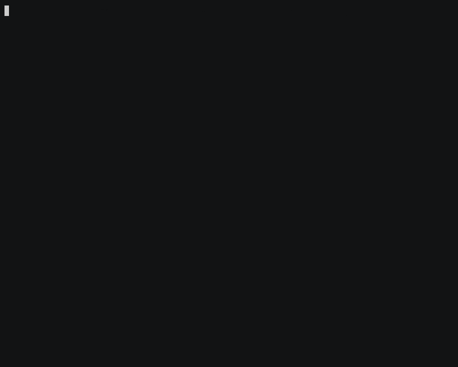

# fdeops usage guide

**What it is:** the engagement layer for **you** (human FDE) + your **AI coding agent** - `@fde` routes skills; `.fde/` holds client-scoped memory on your machine.

**Terminology:** [README § Who this is for](../README.md#who-this-is-for) - **"agent" = AI software, not a human.**

**Start here:** [README](../README.md) - Commands (lifecycle) → All 30 Skills (catalog) → How Skills Work.

<p align="center"></p>

Re-record: [`media/record-session.sh`](../media/record-session.sh).

Day-to-day reference below.

---

## New here? (5 minutes)

1. Install from the README (plugin or `npx skills add suboss87/fdeops --skill fde`), then in chat: `@fde this is Acme` - the AI coding agent binds. That creates `~/fde-engagements/acme/.fde/`. Terminal fallback: `fde resume --init <client-name>`
2. Read **Commands**, **All 30 Skills**, and **Who this is for** in the README
3. Skim [examples/garvey-payments/](../examples/garvey-payments/) Day 1 → Day 10
4. Optional recon, zero config: `npx fdeops scan` in a repo
5. Then: `@fde` + the actual situation (brief wrong, they went quiet, when did we agree, what's the outcome)

You do not pick a skill. **`@fde` routes the AI and loads the right one.**

---

## What to type (in the AI chat only)

| You are… | Example message to the **AI coding agent** |
|----------|---------------------------------------------|
| Starting | `@fde this is Acme` (binds) then `@fde New embed. First meeting tomorrow. Brief says: …` |
| Unsure of real problem | `@fde Workshop done. Ops says they use a spreadsheet nightly.` |
| Just out of a meeting | `@fde Debrief: <paste your raw notes>` |
| Ready to code | `@fde` One change they can see by Friday in module X. Going live after Marco signs staging. |
| Production broken | `@fde API 500 since 2pm deploy.` |
| Sponsor went quiet | `@fde VP stopped replying; still building old scope.` |
| Handing off | `@fde Engagement ends Friday. Need handoff doc.` |
| Two clients | `@fde This is for Project B - sponsor issue on payments.` |

**You** type these. The **AI** executes routing and drafts. **You** approve what ships.

---

## Debrief: meeting notes → memory

The highest-frequency moment in client work: you walk out of a meeting with raw notes. Two ways in:

**Via the agent:** paste the notes to `@fde`. It removes the manual work of writing `decision:` / `risk:` / `delivery:` / `contact:` prefixes yourself (adding `[signal:green|amber|red]` on contact lines when the notes carry trust information) - it does not remove your review. It shows you the structured version first and only pipes it to `fde debrief` after you confirm.

**Directly (zero tokens):** write the prefixes yourself and run:

```bash
fde debrief meeting-notes.md            # or pipe on stdin: pbpaste | fde debrief
fde debrief meeting-notes.md --dry-run  # preview the routing, write nothing
```

Routing is deterministic: `decision:` lines → `decisions.md`, `risk:` → `risks.md`, `delivery:` → `delivery.md`, `contact:` → `stakeholders.md` - each dated. Markdown dressing is tolerated (`- decision:`, `* contact:`, `**Risk:**` all route). Every unprefixed line lands as a dated debrief block in `context.md`, so nothing is lost. Use `--dry-run` the first few times to watch where lines go before trusting it.

Not sure which client a workspace writes to? `fde resume --bind` shows the binding and what actually resolves. Re-running `fde resume --init <other-client>` in a workspace **replaces** its binding (and says so) - a workspace writes to exactly one client, never two.

---

## Ingest: pull large artifacts → same confirm loop

When a transcript or email is too large to paste, or lives in Granola/Slack/Notion:

**Daily without MCP:** paste to `@fde` or `fde ingest stage` a file. That is the complete product.

**Optional pull:** `@fde I want to connect Granola` (or Slack / Notion). You add **that** source MCP; FDEOps does not bundle it and does not push back. Then `@fde pull today's Acme transcript`. The agent fetches text and runs `fde ingest` in this bound workspace (stage → propose → you confirm → apply).

**Directly (zero tokens, you already have the file):**

```bash
fde ingest stage --source granola --title "Sponsor sync 2026-07-29" transcript.txt
fde ingest list
fde ingest propose <id-or-filename>   # → .debrief-propose (same as debrief --smart)
fde ingest apply                      # after you review - same as debrief --apply
```

Raw stays in `~/fde-engagements/<client>/.inbox/`; dated facts land in `.fde/` with optional `via:<source>` provenance. Optional MCP wrapper: `mcp/fdeops-ingest` (stdio tools mirror the verbs). Method detail: [skills/fde/references/ingest.md](../skills/fde/references/ingest.md).

---

## Trust signals

Log stakeholder temperature as structured tokens, not vibes:

```bash
fde log contact "Denise gone quiet since the demo" --signal amber
```

That writes a `[signal:amber]` token into `stakeholders.md`. The **latest dated token per engagement drives the trust column** in `fde status` and `fde dashboard`; a signal older than 21 days shows as **stale** - a prompt to check in, not a verdict. If no tokens exist, status falls back to the older keyword heuristic.

---

## Local CLI (setup, air-gap, scripts)

**You do not need these for daily work.** Chat with `@fde`; the agent runs them. Use the terminal for one-time setup, air-gapped machines, or automation.

**Humans - once / occasional** (prefer chat: `@fde this is Acme`):

```bash
npx fdeops resume --init <client>   # fallback: create + bind this workspace from the terminal
npx fdeops resume                   # check "where we are"
npx fdeops scan                     # try day-1 recon with no install
npx fdeops dashboard                # optional local HTML view of the fieldbook
```

**What you say → what the agent runs** (you never have to type the right-hand side):

| You say | Agent runs |
|---------|------------|
| Debrief these notes | `fde debrief --smart …` → agent rewrites propose with prefixes if needed → you confirm → `--apply` |
| Make sure we're up to date / pull from Granola or email | Capability check → source MCP fetch → `fde ingest stage` → propose → confirm → apply |
| Connect Granola / Notion / a new MCP / what can you pull | Guided `mcp.json` + [mcp/recipes/](../mcp/recipes/); save/reload in host; test stage only |
| Prep me for the sponsor meeting | `fde prep "…"` |
| When did we agree to drop that? | `fde receipts …` |
| Draft the sponsor update | `fde status` (+ judgment in chat) |
| Log that the sponsor went quiet | `fde log contact "…" --signal amber` |
| Wrap the session / share the thinking / before the PR | Session digest into `.fde/` (TL;DR, decisions & why) - not transcript sync |

**Full command list** (power users / scripts):

```bash
fde triage                        # short status (also injected by session hooks)
fde debrief notes.md              # if notes already use decision: / risk: / … prefixes
fde debrief --smart notes.md      # heuristic propose (not AI); agent prefixes → --apply after confirm
fde ingest stage [--source NAME] [--title TEXT] [file|-]  # raw pull → .inbox/
fde ingest list                   # staged items
fde ingest propose <id>           # → .debrief-propose (same smart path)
fde ingest apply                  # after confirm - same as debrief --apply
fde doctor                        # check the fieldbook for gaps
fde prep "sponsor sync"           # walk-in brief from existing memory
fde log decision "…"
fde log contact "…" --signal amber
fde receipts "descope"            # dated agreements (ON RECORD)
fde dashboard --all               # every client, sorted by trust
fde status [--all]                # value ledger, then trust
fde vault [--redacted] [--out D]  # derived Obsidian vault of the whole portfolio (disposable)
fde tidy [--apply]                # propose safe consolidations (fde garden still works)
fde demo                          # the whole loop on a fake client (--clean removes it)
```

Optional: `export FDEOPS_ENGAGEMENTS_ROOT=~/path/to/engagements` to isolate from `~/fde-engagements`.

Each `.fde/` is a local git repo (no remote, no telemetry). Writes stage only the files for that command - hand-edits to other records stay dirty until you review them.

---

## Where files live

```text
~/fde-engagements/<client-name>/
  .fde/
    context.md      ← AI loads first each session (+ dated debrief blocks)
    brief.md        ← what they said (hypothesis)
    reality.md      ← what is actually true
    stakeholders.md ← contacts + [signal:…] tokens
    …
  .inbox/           ← raw staged pulls (ingest); not the memory ledger
```

The workspace registry (written by `fde resume --init`) tells the AI and the hooks which engagement this workspace belongs to - no environment variable needed. (Advanced override: [install.md § FDEOPS_ENGAGEMENT](./install.md#advanced-fdeops_engagement-override).)

---

## Multiple engagements

```bash
cd ~/work/client-a && fde resume --init client-a
cd ~/work/client-b && fde resume --init client-b
```

One folder per client, one binding per workspace. Never merge contexts. `fde status` prints the value ledger (promised → measured → accepted), then trust; `fde dashboard` renders it into one offline HTML fieldbook.

---

## One window over every client (Obsidian)

```bash
fde vault              # → ~/fde-vault, then: Obsidian → Open folder as vault
fde vault --redacted   # → ~/fde-vault-redacted, safe for a shared screen
```

Obsidian ignores any path starting with `.`, so pointing it at `~/fde-engagements` shows nothing - every record lives inside `.fde/`. `fde vault` therefore writes a **derived** vault: a `Portfolio` page across all clients, one page per engagement (phase, trust, next action, timeline, people), a `Questions` page (gone quiet, value nobody accepted, stale signals), plus frontmatter and `[[wikilinks]]` so search and graph view work with no plugins installed.

The rules that keep it from becoming a second memory:

- `.fde/` stays the only source of truth. The vault is **never** read back.
- It is **disposable** - every run deletes and rebuilds it, so anything typed there is lost. Log to the fieldbook instead (`@fde`, or `fde log`).
- It is gitignored, and it refuses to build over `$HOME`, your engagements root, a `.fde/` folder, a symlink, or any directory it did not write itself.
- `--redacted` drops `stakeholders.md`, `trust-profile.md`, people pages, trust signals and contact notes - on top of the `<private>` redaction every FDEOps output already does.

---

## What fdeops does not do

The skills are refined from real engagements, not autonomy - they tell you what to check, not what to decide. Concretely, fdeops does not:

- Replace **you** in meetings or politics
- Grant repo access or stakeholder buy-in
- Replace legal/compliance review (overlays are judgment aids only)
- Run on client infrastructure or shared git by default

---

## More

- [install.md](./install.md) - install matrix
- [OPERATIONS.md](./OPERATIONS.md) - operating rules
- [schema.md](./schema.md) - `.fde/` files
- [skills.md](./skills.md) - the skills matrix + overlays
- [skills-reference.md](./skills-reference.md) - the 30 skills
